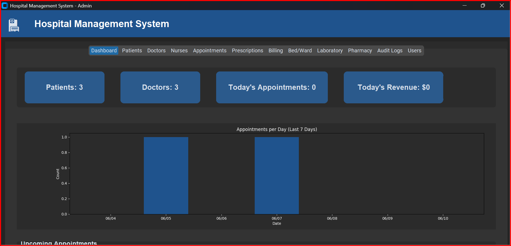
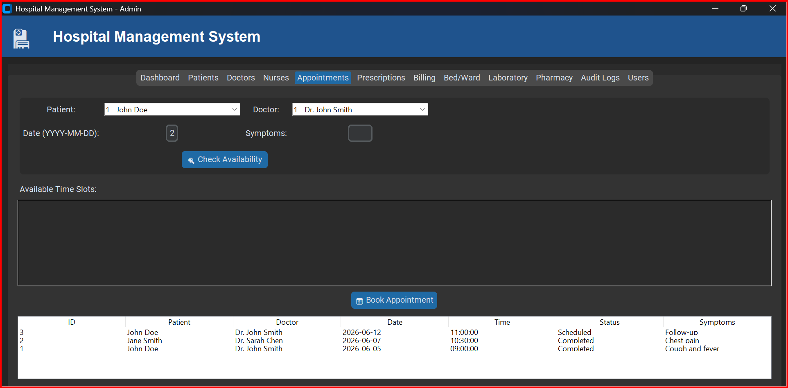
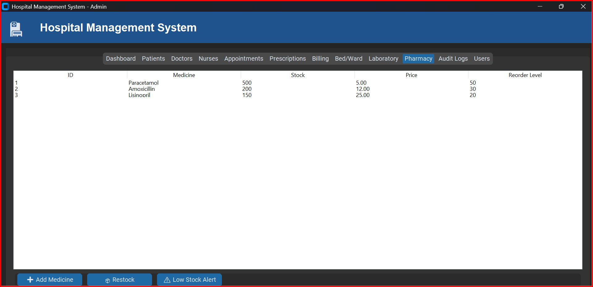

# 🏥 Hospital Management System – DBMS Final Project

A complete hospital management system with a modern GUI (Python + CustomTkinter) and a SQL Server backend.  
Supports **Admin**, **Doctor**, **Receptionist**, and **Patient** roles with full CRUD operations, appointment scheduling, bed/ward management, laboratory test ordering, pharmacy inventory, prescription PDF generation, Excel export, and audit logging.

---

## 📸 Screenshots

| Login Page | Dashboard | Appointments | Pharmacy |
|------------|-----------|--------------|----------|
|  |  |  |  |

---

## 🗄️ Diagrams

All design diagrams are available in the [`ERD Diagrams/`](ERD%20Diagrams/) folder:

- [ER Diagram](ERD%20Diagrams/ERDDiagram.jpg)
- [Data Flow Diagram](ERD%20Diagrams/Data%20flow%20Diagram.jpg)
- [Use Case Diagram](ERD%20Diagrams/Use%20case.jpg)
- [Class Diagram](ERD%20Diagrams/Class%20Diagram.jpg)
- [Activity Diagram](ERD%20Diagrams/Activity%20Diagram%20Diagram.jpg)
- [Sequence Diagram](ERD%20Diagrams/Sequence%20Diagram.jpg)
- [System Architecture Diagram](ERD%20Diagrams/System%20architecture%20Diagram.jpg)
- [Database Schema](ERD%20Diagrams/Schema.jpg)
- [Flowchart](ERD%20Diagrams/Flow%20chart.jpg)

---

## ✨ Features

- **Role‑based access** – Admin, Doctor, Receptionist, Patient each see only relevant modules.
- **Patient Management** – Add, edit, search, delete, export to Excel.
- **Doctor Management** – Add doctors, set weekly availability (day, start/end time, slot duration).
- **Nurse Management** – Assign nurses to doctors.
- **Appointment Scheduling** – Check doctor availability, display free time slots, book appointments.
- **Prescriptions** – Create, edit, and generate PDF prescriptions.
- **Billing** – Consultation fee + extra charges, record payments (paid/unpaid/partial).
- **Bed/Ward Management** – Admit / discharge patients, allocate beds, see bed occupancy.
- **Laboratory** – Order lab tests, enter results, track status.
- **Pharmacy** – Manage medicine stock, restock, low‑stock alerts.
- **Audit Logs** – Automatic logging of all insert/update/delete operations (database triggers).
- **Dashboard** – Real‑time statistics (patient/doctor counts, today’s appointments, revenue) and a 7‑day appointment chart.
- **Export to Excel** – Any table can be exported.
- **Email placeholders** – Code structure ready for SMTP integration (optional).

---

## 🛠️ Technologies Used

| Component       | Technology                              |
|----------------|-----------------------------------------|
| Frontend GUI   | Python 3.10+ with **CustomTkinter**     |
| Backend        | **pyodbc** (SQL Server connector)       |
| Database       | Microsoft SQL Server (Express or higher)|
| Charts         | **Matplotlib**                          |
| PDF Generation | **FPDF**                                |
| Excel Export   | **pandas** + **openpyxl**               |
| Audit Logging  | Database triggers (T‑SQL)               |

---

## 💻 System Requirements

- **Windows** (recommended) or macOS/Linux with a SQL Server instance.
- **Python 3.10 or higher** installed.
- **Microsoft SQL Server** (Express, Developer, or Standard) – must be running.
- **SQL Server Management Studio (SSMS)** – to run the database script.
- **ODBC Driver 18 or 17 for SQL Server** – installed (the code will try multiple drivers).

---

## 📦 Installation & Setup (Step by Step)

### 1. Clone the repository
```bash
git clone https://github.com/wahajismail66/Hospital_Management_System_DBMS_LAB.git
cd Hospital_Management_System_DBMS_LAB
2. Install required Python packages
bash
pip install pyodbc customtkinter pillow matplotlib pandas openpyxl fpdf
3. Create the database in SQL Server
Open SQL Server Management Studio (SSMS).

Connect to your SQL Server instance (e.g., localhost\SQLEXPRESS for Express edition, or localhost for default instance).

Open the file Hospital_Final_ProjectQuery.sql.

Execute the script (press F5).

Wait for the message Database created and audit triggers enabled.

Refresh the Databases list – you should see Hospital_Final_Project.

4. Configure the Python connection
If you are using SQL Server Express, the default connection string in the code is already correct:
SERVER = r"localhost\SQLEXPRESS"

If you are using a default instance (MSSQLSERVER), change that line to:
SERVER = r"localhost"

(Edit hospital_system.py with any text editor.)

5. (Optional) Add a hospital logo
Place a file named hospital_logo.png in the same folder as the Python script. The GUI will display it on the login screen and header. If no image is found, a hospital emoji (🏥) is used instead.

🚀 Running the Application
Make sure SQL Server is running (services: SQL Server (SQLEXPRESS) or MSSQLSERVER).

Open a Command Prompt in the project folder.

Run:

bash
python hospital_system.py
The login window will appear.

🔐 Default Login Credentials
Role	Username	Password
Admin	admin	admin123
Doctor	dr.smith	dr.smith
Receptionist	reception	reception
Patient	john.doe	john.doe
These users are inserted automatically by the SQL script.

📁 Project Structure
text
Hospital_Management_System_DBMS_LAB/
│
├── Hospital_Final_ProjectQuery.sql   # Database creation script
├── hospital_system.py                # Main Python application
├── README.md                         # This file
├── Screenshots/                      # GUI screenshots
│   ├── Login Page.png
│   ├── Dashboard.png
│   ├── Appointment.png
│   └── Pharmacy.png
├── ERD Diagrams/                     # Design diagrams
│   ├── ERDDiagram.jpg
│   ├── Data flow Diagram.jpg
│   ├── Use case.jpg
│   ├── Class Diagram.jpg
│   ├── Activity Diagram Diagram.jpg
│   ├── Sequence Diagram.jpg
│   ├── System architecture Diagram.jpg
│   ├── Schema.jpg
│   └── Flow chart.jpg
└── (generated files)                 # Prescription PDFs, Excel exports
👥 Contributors
Umar Kamran – GitHub Profile

Barkha Khatri

Muhammad Wahaj – GitHub Profile

📄 License
This project was developed for educational purposes (DBMS Lab). You may use it as a reference for your own academic work. Commercial use is not permitted without permission.

⭐ Support
If you find this project helpful, please give it a star on GitHub.
For issues or questions, open an Issue on the repository.
